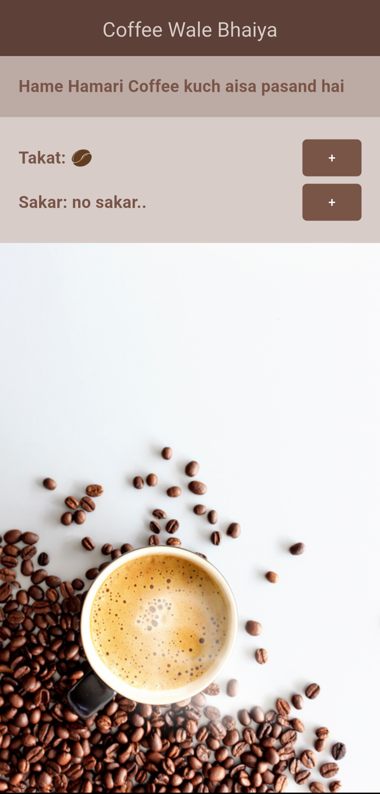
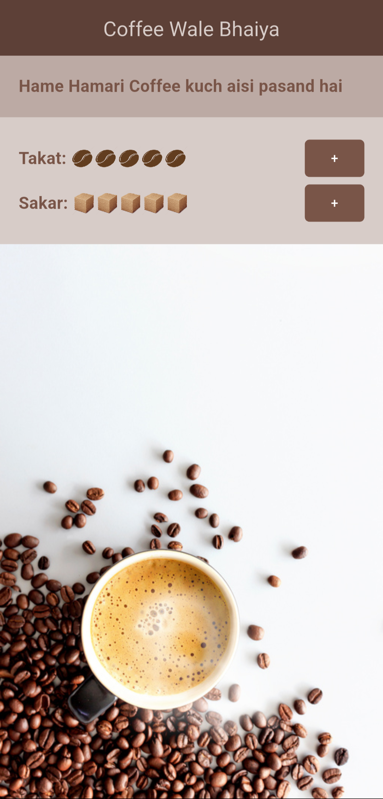

# ☕ Coffee Wale Bhaiya

A simple and fun Flutter app where you can customize your coffee preferences.  
Choose the **strength** (represented by coffee beans) and **sugar level** (represented by sugar cubes), and watch your coffee card update instantly!  

---

## 🚀 Features
- Adjust coffee **strength** (1–5 beans).
- Adjust **sugar levels** (0–5 cubes).
- Interactive UI with buttons for easy customization.
- Clean and reusable Flutter widgets:
  - `StyledButton`
  - `StyledBodyText`
  - `CoffeePrefs`
- Coffee-themed UI with rich colors and background images.

---

## 📂 Project Structure
```
lib/
├── main.dart # Entry point
├── home.dart # Home screen with app layout
├── coffee_prefs.dart # Widget to manage coffee strength & sugar
└── shared/
├ ├── styled_button.dart # Custom reusable button
└ └── styled_body_text.dart # Custom styled text
assets/
├── img/coffee_bg.jpg # Coffee background image
├── img/coffee_bean.png # Coffee bean icon
└── img/sugar_cube.png # Sugar cube icon
```

---

## 📸 Screenshots

| Home Screen | Strength & Sugar Controls |
|-------------|---------------------------|
|  |  |

---

## 🛠️ Built With
- [Flutter](https://flutter.dev/) – Framework  
- [Dart](https://dart.dev/) – Language  

---

## 📦 How to Run
1. Clone this repo:
   ```bash
   git clone https://github.com/your-username/coffee_project.git
